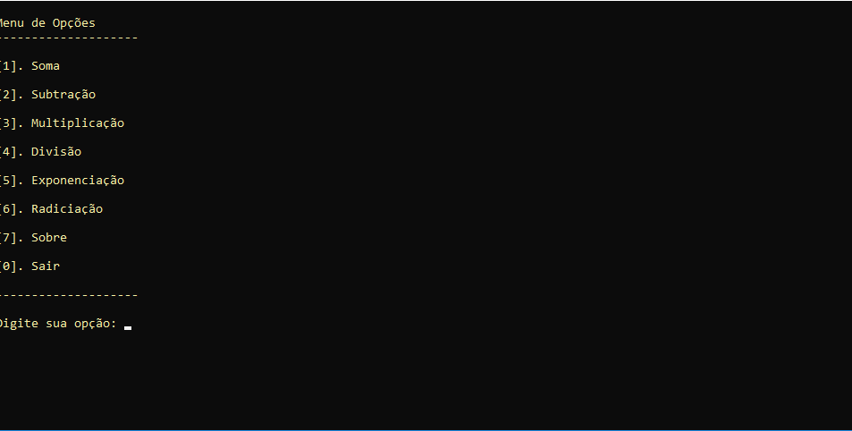
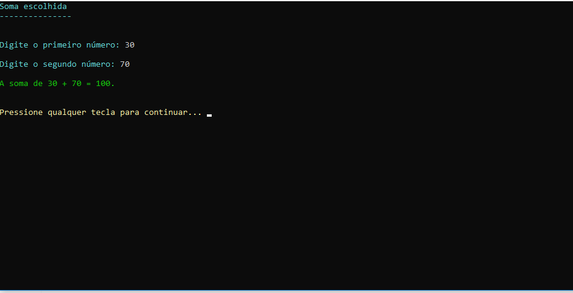
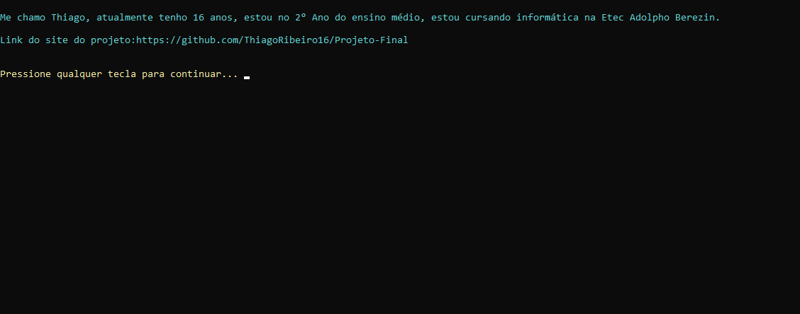
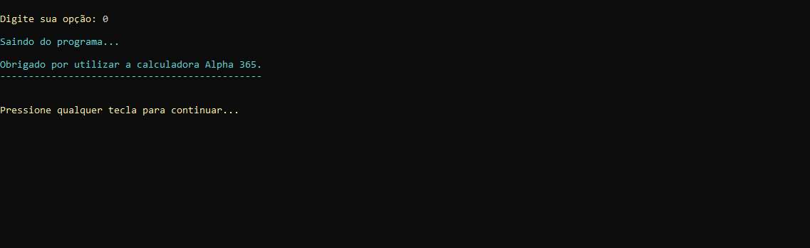

# Calculadora Alpha 365
Este software contem um menu de opções selecionáveis pelo usuário e faz operações matemáticas. As quatro operações aritméticas básicas (soma, subtração, multiplicação e divisão);
E   xponenciação e radiciação;. 


## Exemplo

```
---------------------
Calculadora Alpha 365
---------------------


Menu de Opções
--------------------

[1]. Soma 

[2]. Subtração 

[3]. Multiplicação 

[4]. Divisão 

[5]. Exponenciação 

[6]. Radiciação 

[7]. Sobre 

[0]. Sair 

--------------------

Digite sua opção: 1


Soma escolhida
---------------


Digite o primeiro número: 20

Digite o segundo número: 80

A soma de 20 + 80 = 100.


Sobre
------------

Me chamo Thiago, atualmente tenho 16 anos, estou no 2° Ano do ensino médio, estou cursando informática na Etec Adolpho Berezin.
 
Link do site do projeto:https://github.com/ThiagoRibeiro16/Projeto-Final


Sair
-----------

Saindo do programa...

Obrigado por utilizar a calculadora Alpha 365.
----------------------------------------------


```

## _Screenshots_











## _Download_

Baixe o arquivo abaixo. Descompacte na paste desejada.

[🔽 Download do arquivo .zip](dist/CalculadoraAlpha.zip)

Execulte utilizando o comando:

```
dotnet Projeto-Final.dll
```

Ou, se você estiver no Windons, pode dar um duplo-clique no ícone do programa.

## Agradecimentos 

- [Etec Adolpho Berezin](http://eteab.com.br/cms/)
- [Prof. Ermogenes](https://github.com/ermogenes) 
- [Prof. Diego Neri](https://github.com/diegoneri)
- [Dev C#](https://github.com/ThiagoRibeiro16/Projeto-Final)

---

Todos os diretos reservados. PIRATARIA É CRIME.